# 📝 Tasky - Task Management App

A modern, feature-rich Task Management Application built with Flutter, designed to help you organize your daily tasks efficiently with a sleek and responsive UI.

## ✨ Features

- **Task Management**: Easily create and manage your daily tasks.
- **Categorization**: Filter tasks by status (Todo and Completed) to stay organized.
- **User Profile**: Personalize your experience with user details and profile settings.
- **Offline Persistence**: Your tasks and settings are saved locally using Hydrated Bloc and Shared Preferences.
- **Dark/Light Mode**: Seamlessly switch between light and dark themes for a comfortable viewing experience.
- **Responsive Design**: Optimized for various screen sizes using Flutter ScreenUtil.
- **Smooth Animations**: Interactive UI with fluid transitions.

## 🛠️ Tech Stack

This project leverages a robust stack of libraries and tools to ensure performance, scalability, and maintainability:

- **Framework**: [Flutter](https://flutter.dev/)
- **Language**: [Dart](https://dart.dev/)
- **State Management**: [Flutter Bloc](https://pub.dev/packages/flutter_bloc) & [Hydrated Bloc](https://pub.dev/packages/hydrated_bloc)
- **Dependency Injection**: [GetIt](https://pub.dev/packages/get_it)
- **Networking**: [Dio](https://pub.dev/packages/dio) (Prepared for API integration)
- **Routing**: [GoRouter](https://pub.dev/packages/go_router)
- **Local Storage**: [Shared Preferences](https://pub.dev/packages/shared_preferences)
- **UI/UX**:
  - [Flutter ScreenUtil](https://pub.dev/packages/flutter_screenutil) (Responsive Design)
  - [Flutter SVG](https://pub.dev/packages/flutter_svg) (Vector graphics)
  - [Cached Network Image](https://pub.dev/packages/cached_network_image)
  - [Animations](https://pub.dev/packages/animations)
  - [Curved Labeled Navigation Bar](https://pub.dev/packages/curved_labeled_navigation_bar)

## 📂 Project Structure

The project follows a **Feature-First Clean Architecture** to ensure scalability and separation of concerns:

```
lib/
├── core/           # Core functionality (Connections, Database, Enums, Theme, Routing, Utils)
├── features/       # Feature-based modules
│   └── home/       # Home & Task Management Feature
│       ├── data/         # Data layer (Models, Repositories, Data Sources)
│       ├── di/           # Dependency Injection for the feature
│       ├── domain/       # Domain layer (Entities, Repositories)
│       ├── presentation/ # UI layer (Blocs, Screens, Widgets)
│       └── routes/       # Feature-specific routes
├── main.dart       # Application entry point
└── common_di.dart  # Global dependency injection setup
```

## 📸 Screenshots

<markdown-accessiblity-table data-catalyst=""><table>

<thead>
<tr>
<th>Dark Mode</th>
<th>Light Mode</th>
</tr>
</thead>
<tbody>
<tr>
<td> 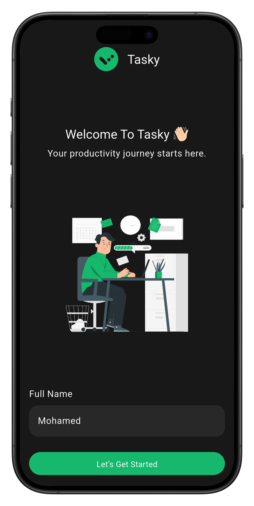</td>
<td> </td>
</tr>
<tr>
<td>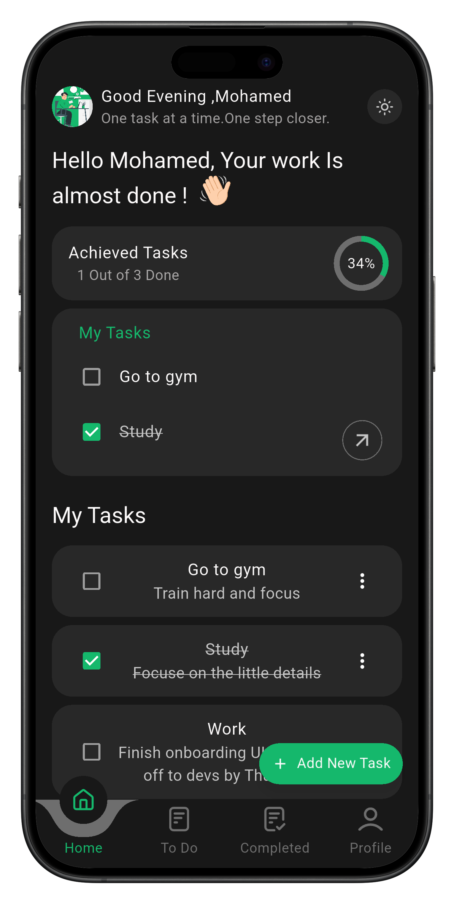</td>
<td>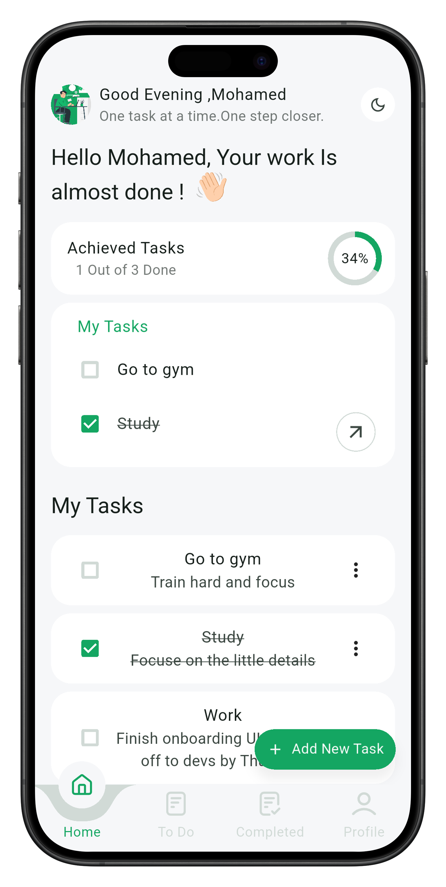</td>
</tr>
<tr>
<td>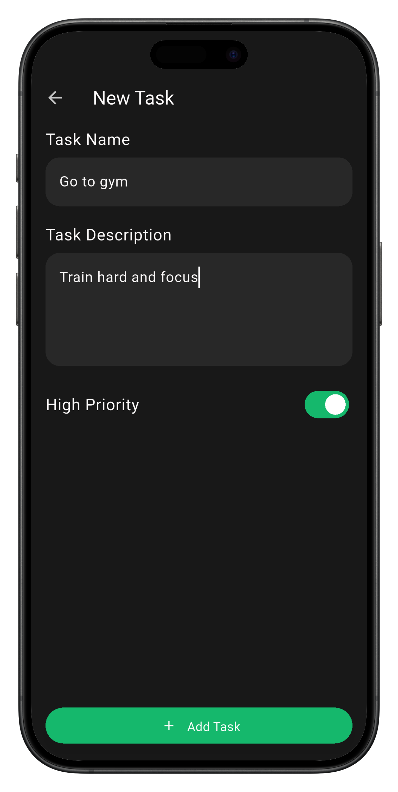</td>
<td>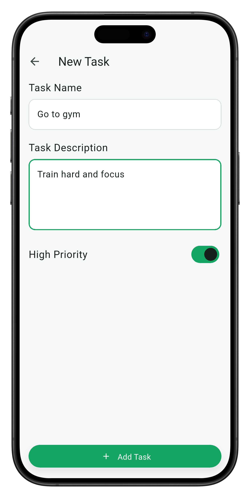</td>
</tr>
<tr>
<td>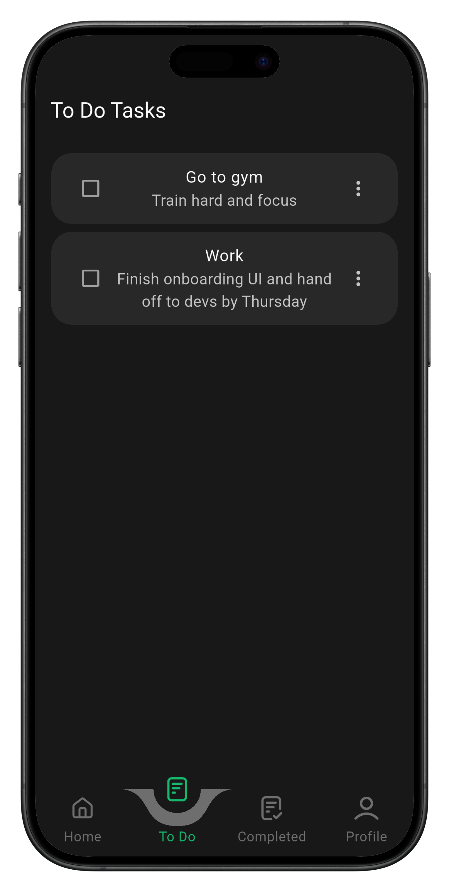</td>
<td>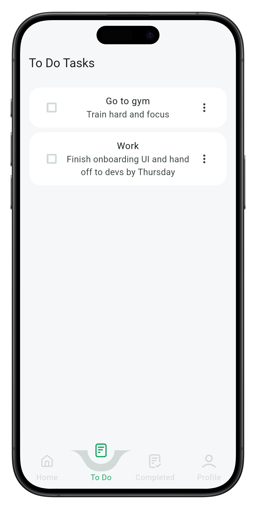</td>
</tr>
<tr>
<td>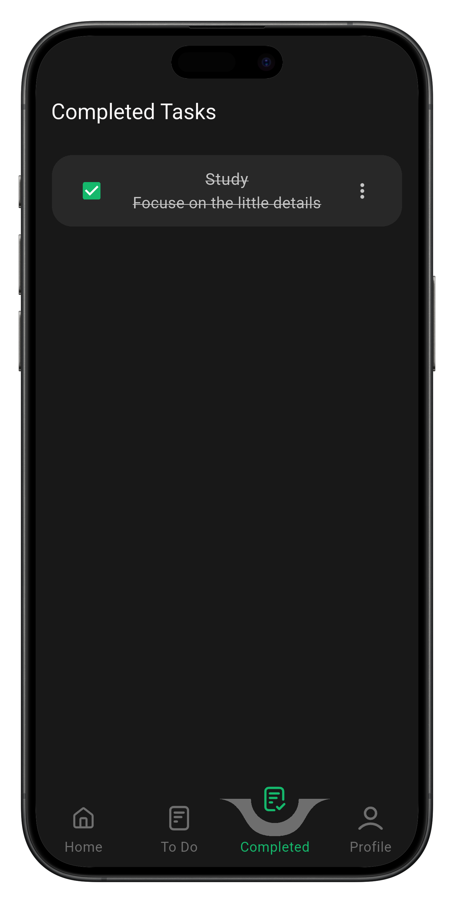</td>
<td>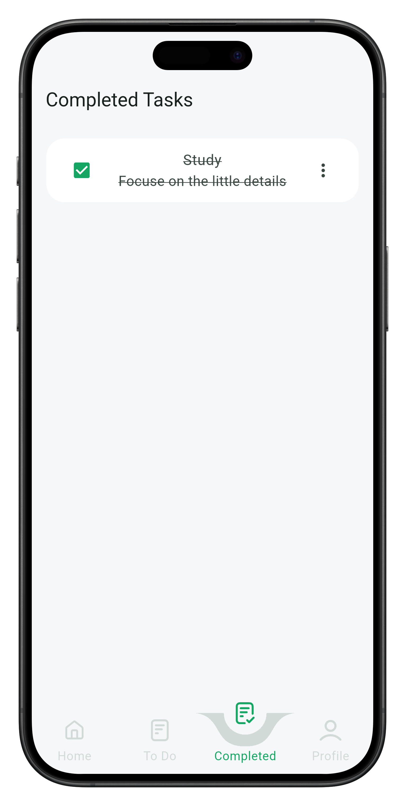</td>
</tr>
<tr>
<td>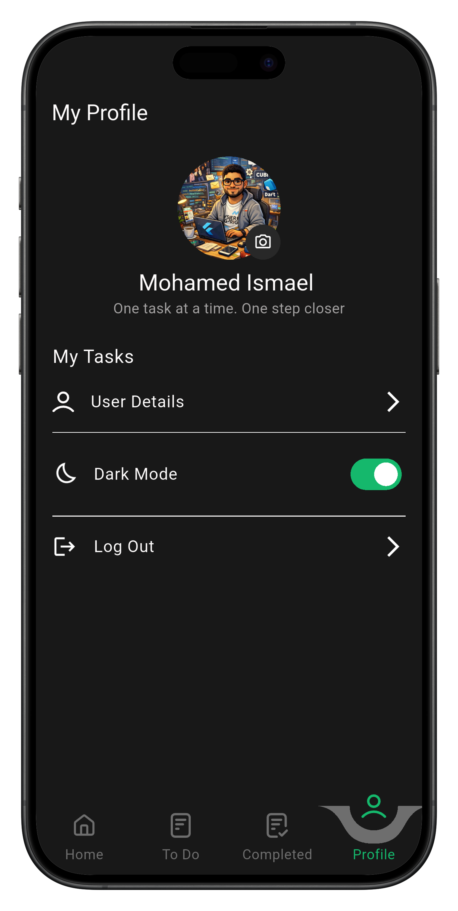</td>
<td>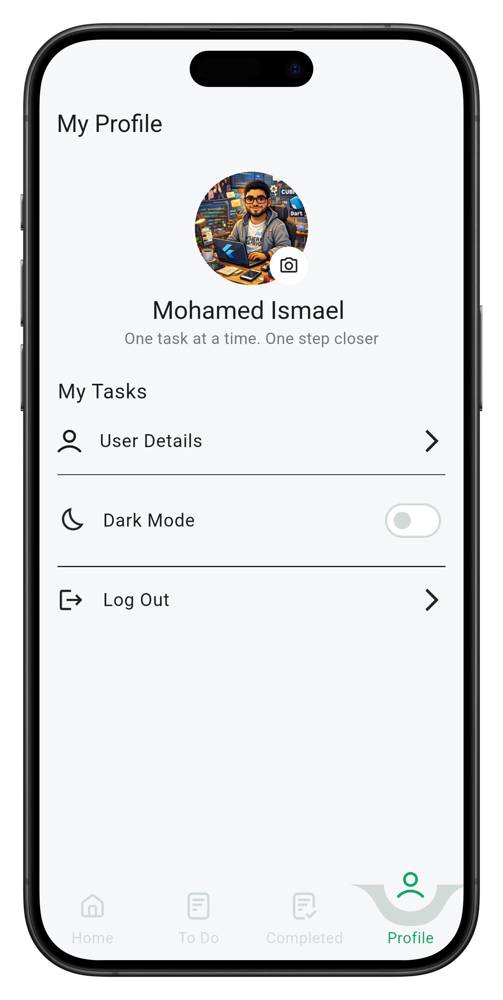</td>
</tr>
</tbody>
</table></markdown-accessiblity-table>

*Note: Replace placeholders with actual screenshots from the app.*

## 🚀 Getting Started

Follow these steps to set up the project locally.

### Prerequisites

- [Flutter SDK](https://docs.flutter.dev/get-started/install)
- [Dart SDK](https://dart.dev/get-dart)
- An IDE (VS Code, Android Studio, or IntelliJ)

### Installation

1.  **Clone the repository**:

    ```bash
    git clone https://github.com/Mohamedismaell/tasky.git
    cd tasky
    ```

2.  **Install dependencies**:

    ```bash
    flutter pub get
    ```

3.  **Run the app**:
    ```bash
    flutter run
    ```

## 🧪 Testing

To run the tests:

```bash
flutter test
```

## 🤝 Contributing

Contributions are welcome! Please feel free to submit a Pull Request.

1.  Fork the project
2.  Create your Feature Branch (`git checkout -b feature/AmazingFeature`)
3.  Commit your changes (`git commit -m 'Add some AmazingFeature'`)
4.  Push to the Branch (`git push origin feature/AmazingFeature`)
5.  Open a Pull Request

